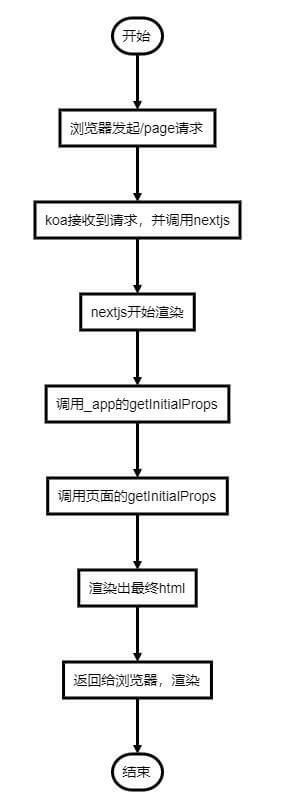
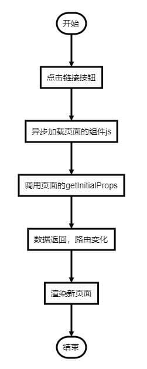
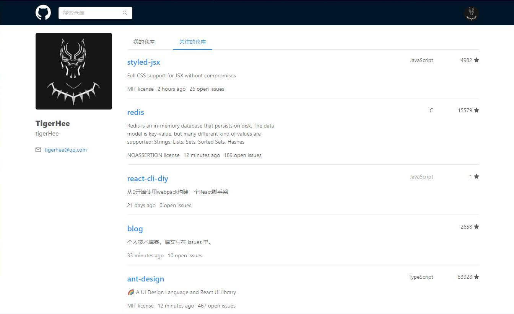
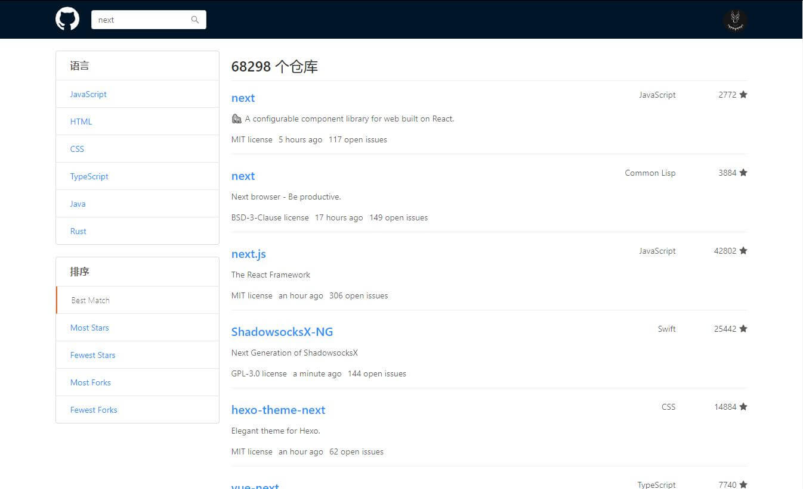
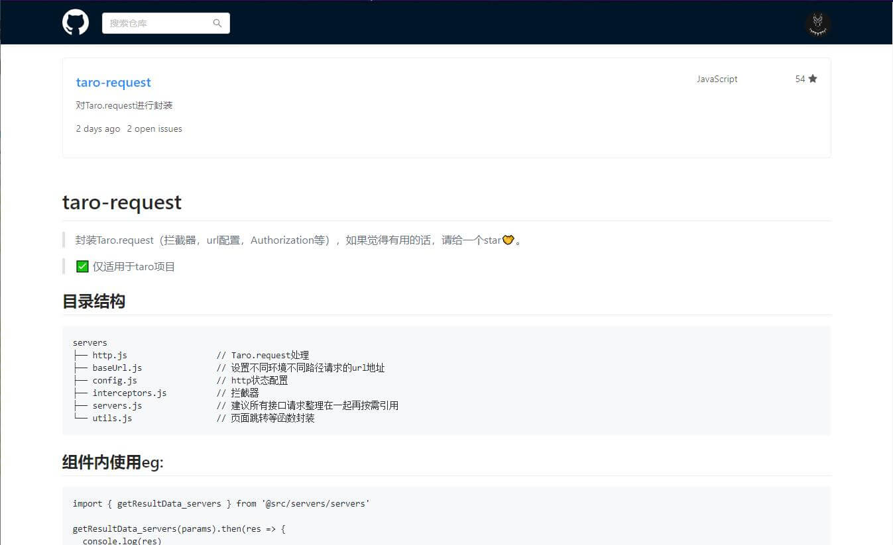
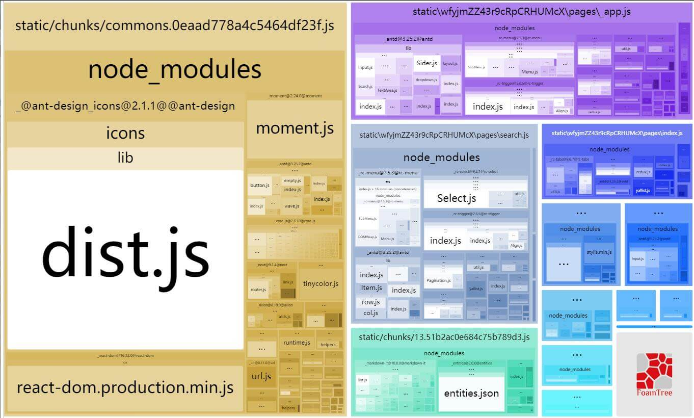

## 使用next+koa2实现React服务端渲染(开发中...)

### 项目创建方式：

```
// 法1：

npm init
npm i react react-dom next -S
配置package.json里的scripts
新建各个文件

// 法2：

npm i -g create-next-app
npx create-next-app testApp

```

##### 需要先安装redis并启动环境：

[windows下载安装redis](https://github.com/microsoftarchive/redis/releases)

### 启动方式:

```
// 开发模式启动
npm run dev

// 打包资源分析
npm run analyze:browser
```

### SSR页面渲染流程：



### 客户端路由跳转：



### 项目效果图：

首页：


搜索结果页：


仓库详情页：


打包分析：
